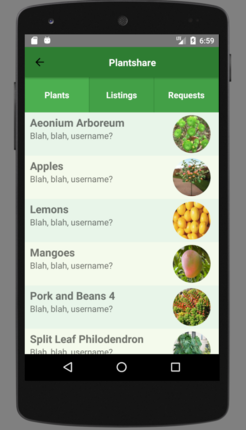

# Plantshare

<p align="center">
  <a href="https://colinritchey.github.io/PlantShareDemo/">
    
  </a>
</p>

[Live link](https://colinritchey.github.io/PlantShareDemo/)

[Github link](https://github.com/whasting/Plantshare)

PlantShare is a mobile plant/produce distribution app that allows users
to post and request plants from other users. The dashboard keeps track of
current listings, a user's own listings and their requests. Owners of the
plant can approve or deny requests.


## Design Docs
* [View Wireframes][wireframes]
* [React Components][components]
* [API endpoints][api-endpoints]
* [DB schema][schema]
* [Sample State][sample-state]

[wireframes]: docs/wireframes
[components]: docs/component-hierarchy.md
[sample-state]: docs/sample-state.md
[api-endpoints]: docs/api-endpoints.md
[schema]: docs/schema.md

## Technologies & Technical Challenges

Plantshare uses Rails on the backend and React Native on the frontend with a full Redux cycle. Two of the more challenging obstacles faced in developing the mobile app are

* Challenge 1
* Challenge 2

```javascript
class App extends React.Component {
  render() {
    return (
      <AppNavigator style={styles.navbar} />
    );
  }
}
```

## Screenshots

<p align="center">

</p>

<p align="center">

</p>

<p align="center">

</p>

<p align="center">

</p>

## Group Members

#### [Eddie Lao](https://github.com/eddielao)

#### [Colin Ritchey](https://github.com/colinritchey)

#### [Wade Hastings](https://github.com/whasting)

## Upcoming Features:

(Coming Soon) Additionally, the site will be using a combination of Google Maps Api to display the location of a plant detail item and Cloudinary image storage Api to allow users to upload images of their plants.

  - [ ] Image uploading
  - [ ] Google maps, be able to post where you are distributing your plants
