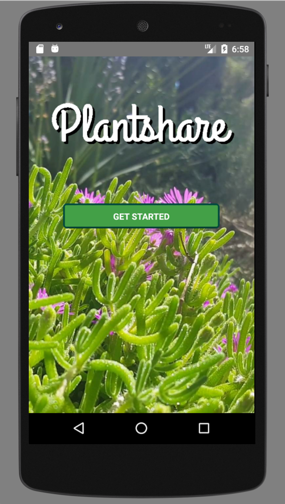

# Plantshare

[Live][demo]

[demo]:https://colinritchey.github.io/PlantShareDemo/

PlantShare is a mobile plant/produce distribution app that allows users
to post and request plants from local users. The dashboard keeps track of
current listings, a user's own listings and their requests. Owners of the
plant can approve or deny requests.

## Design Docs
* [View Wireframes][wireframes]
* [React Components][components]
* [API endpoints][api-endpoints]
* [DB schema][schema]
* [Sample State][sample-state]

[wireframes]: docs/wireframes
[components]: docs/component-hierarchy.md
[sample-state]: docs/sample-state.md
[api-endpoints]: docs/api-endpoints.md
[schema]: docs/schema.md

## Technologies & Technical Challenges

Plantshare will be using Rails on the backend and React Native on the frontend.

(Coming Soon) Additionally, the site will be using a combination of Google Maps Api to display the location of a plant detail item and Cloudinary image storage Api to allow users to upload images of their plants.

## images

## Group Members

#### [Eddie Lao](https://github.com/eddielao)

#### [Colin Ritchey](https://github.com/colinritchey)

#### [Wade Hastings](https://github.com/whasting)

## Upcoming Features:

  - [ ] Image uploading
  - [ ] Google maps, be able to post where you are distributing your plants
